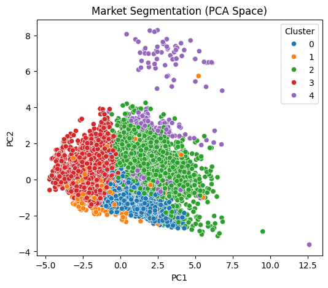

# Melbourne housing: segmentation and price prediction

[](https://juanariza-1.github.io/house-price-analysis/)

<a href="https://juanariza-1.github.io/house-price-analysis/">
  
</a>

*Click the button or preview to open the complete report with its saved figures and results.*

**Author:** Juan Pablo Ariza Gallo  
**Course:** Machine Learning — Individual Final Project  
**Original project date:** March 2026

An academic study of the Melbourne housing market covering missing data, outlier treatment, feature preprocessing, PCA, market segmentation, and price prediction. It compares linear regression, Ridge, Lasso, Random Forest, Gradient Boosting, XGBoost, and a multilayer perceptron on the original features and on features augmented by PCA and cluster labels.

## Explore the work

- [Notebook with the original saved outputs](notebooks/melbourne-housing.ipynb)
- [Final HTML report](reports/melbourne-housing.html): download and open in a browser to read the complete notebook without installing Python.

The HTML report is exported from the saved notebook outputs. The original analysis, figures, tables, model settings, and narrative are retained. Machine-specific paths in saved warning messages are replaced by `[local-path]`.

## Original results

The saved analysis identifies XGBoost on Dataset A as the strongest model, with R² ≈ 0.873, RMSE ≈ 199,788, and MAE ≈ 132,417. Adding PCA and cluster features did not improve the ensemble models in this submission. These are the original recorded estimates, not newly generated production benchmarks.

## Run the notebook

The original notebook records Python 3.14.2. Create a separate environment and install the project dependencies:

```text
python -m venv .venv
.venv\Scripts\python -m pip install -r requirements.txt
.venv\Scripts\python -m jupyter lab
```

These commands use the environment's interpreter explicitly on Windows. On macOS or Linux, use `.venv/bin/python` in place of `.venv\Scripts\python`.

Open `notebooks/melbourne-housing.ipynb` and run its cells in order. It retrieves [Anthony Pino's Melbourne Housing Market dataset](https://www.kaggle.com/datasets/anthonypino/melbourne-housing-market), using **version 27** and `Melbourne_housing_FULL.csv`, matching the dataset revision recorded in the original output. KaggleHub uses its usual download cache and may require Kaggle authentication depending on the local environment. Credentials must remain outside the repository.

For an offline run, set the `MELBOURNE_HOUSING_CSV` environment variable to the path of a local version-27 `Melbourne_housing_FULL.csv` before opening the notebook. The dataset is not redistributed; consult its Kaggle page for its terms and attribution. The grids include hundreds of model fits, so a complete run can take substantial time and memory.

To create a new HTML export after an explicit rerun:

```text
.venv\Scripts\python -m jupyter nbconvert --to html notebooks/melbourne-housing.ipynb --output melbourne-housing --output-dir reports
```

`requirements.txt` pins the seven analysis packages to versions checked in the existing Python environment, and lists notebook tools separately. It is not a complete historical dependency lockfile; numerical backends and parallel execution may affect reproduced values.

## Validation

The complete original analysis ran without execution errors in Python 3.14.2 against the local version-27 CSV, retaining every model grid and parameter. Dependency installation was handled separately from the notebook. The prepared input cell was tested independently, and its preprocessing produced the same final 9,964-row analysis dataset and 359-column feature matrix as the original. The remaining 83 analytical code cells are unchanged. XGBoost Dataset A reproduced all three recorded metrics exactly. The public notebook and HTML retain the original saved outputs. Lasso and neural-network convergence warnings observed during validation remain follow-up findings; model settings were not changed to suppress them.

## Scope and possible extensions

This is an archived academic analysis. The original preprocessing and statistical decisions are preserved. Points for a future revised analysis include:

- The `BuildingArea` imputation is stored in `df_impute`, while later analysis continues with `df`. The subsequent area filter therefore removes rows with missing original area; using the imputed values would change the sample and results.
- Imputation, scaling, PCA, and clustering occur before the final train/test split. Fit those transformations within each training fold for a stricter out-of-sample evaluation.
- Investigate Lasso and neural-network convergence warnings before making claims about converged estimates.
- Consider temporal or geographic validation, property-segment error checks, and explicit uncertainty estimates before applying a valuation model outside the coursework setting.

These changes are proposed separately because they would alter the published academic estimates.
